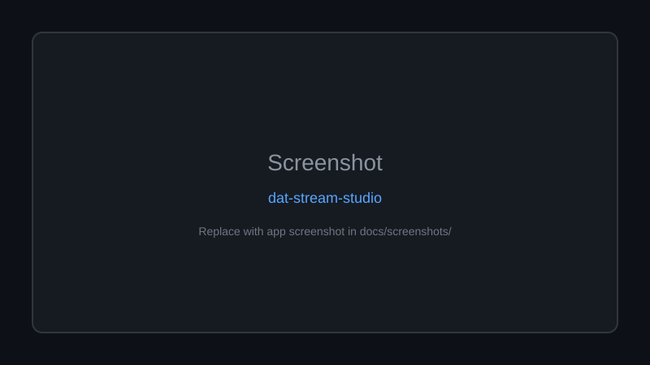
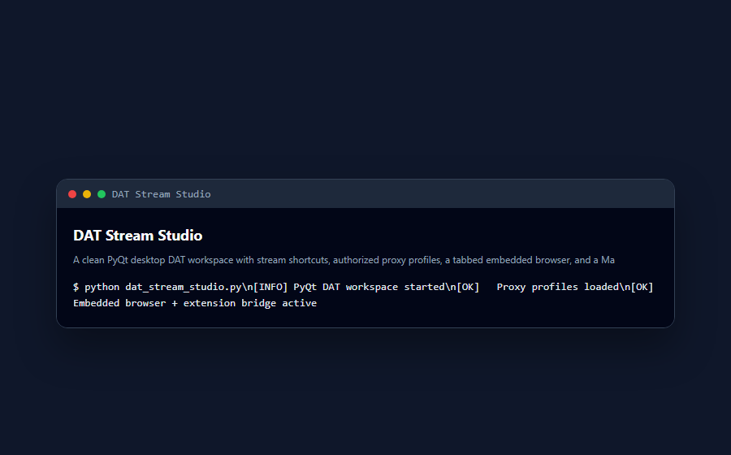

<div align="center">

# 🚀 DAT Stream Studio

**A clean PyQt desktop DAT workspace with stream shortcuts, authorized proxy profiles, a tabbed embedded browser, and a Manifest V3 companion extension for local DAT session tools.**

Documented · MIT licensed · Maintained

[](https://www.python.org/)
[](LICENSE)
[](CONTRIBUTING.md)

[Features](#-features) · [Quick Start](#-quick-start) · [Screenshots](#-screenshots) · [Contributing](CONTRIBUTING.md)

</div>

---

## 🖼 Screenshots



*Replace `docs/screenshots/placeholder.svg` with real app screenshots.*

---

## 🐍 Contribution graph


<picture>
  <source media="(prefers-color-scheme: dark)" srcset="https://raw.githubusercontent.com/mafzalkalwardev/dat-stream-studio/output/snake-dark.svg" />
  <source media="(prefers-color-scheme: light)" srcset="https://raw.githubusercontent.com/mafzalkalwardev/dat-stream-studio/output/snake.svg" />
  
</picture>


---

A clean DAT workspace inspired by a reverse-engineering assignment.

This repository contains two pieces:

- `dat_stream_studio/`: PyQt6 desktop app with stream shortcuts, authorized proxy profiles, a tabbed embedded browser, persistent local browser profile, plus a no-install Tkinter fallback.
- `dat_companion_extension/`: Manifest V3 Chrome companion extension for DAT shortcuts and local DAT cookie count/clear tools.

The project intentionally avoids shared cookies, embedded DAT/Auth0 sessions, GitHub token cookie sync, automatic cookie merge/push, and UI suppression. Use only DAT accounts, sessions, and proxies you are authorized to use.

## Desktop App

No-install fallback:

```powershell
cd dat_stream_studio
py -3 lite_app.py
```

Full embedded-browser mode:

```powershell
cd dat_stream_studio
py -3 -m venv .venv
.\.venv\Scripts\python.exe -m pip install -r requirements.txt
.\.venv\Scripts\python.exe app.py
```

`app.py` prefers PySide6, then PyQt6, then PyQt5. The pinned assignment path uses PyQt6/PyQt6-WebEngine from `dat_stream_studio/requirements.txt`.

Build an EXE:

```powershell
cd dat_stream_studio
.\build_lite.ps1
```

## Companion Extension

1. Open `chrome://extensions`.
2. Enable Developer mode.
3. Click **Load unpacked**.
4. Select `dat_companion_extension`.

## Stream Configuration

Edit `dat_stream_studio/sample_streams.json`, or create `dat_stream_studio/streams.local.json` for local-only stream/proxy settings.

## Screenshots



